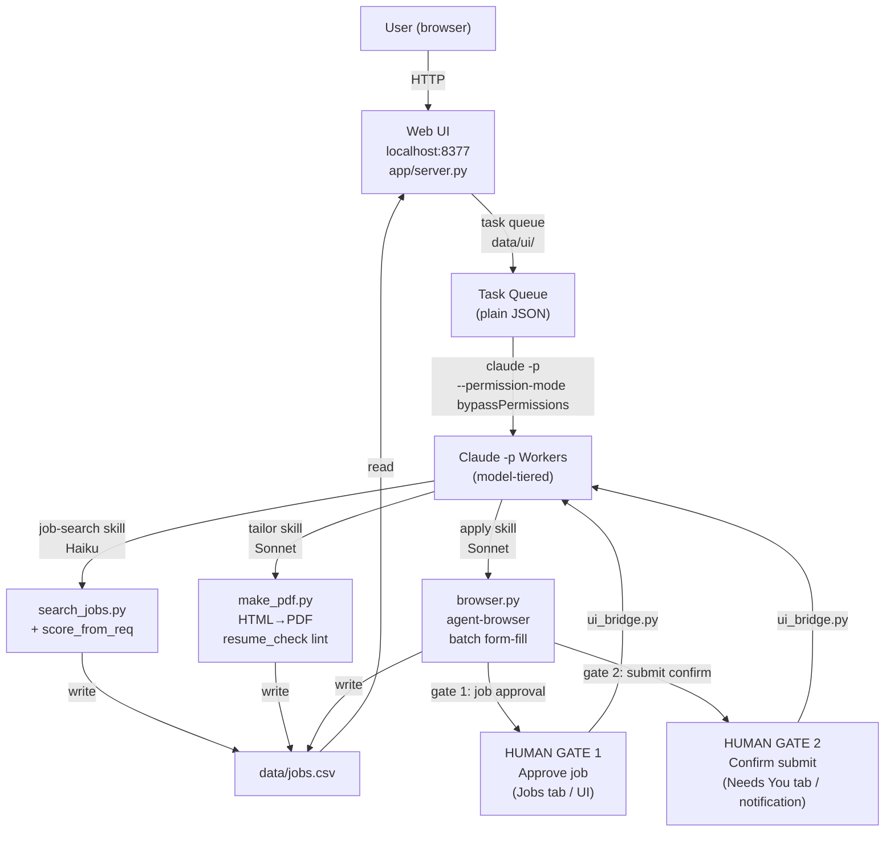

# career-agent

A human-in-the-loop, token-efficient agentic job-application copilot that runs entirely on a Claude Code subscription — no API keys, no paid SaaS.

---

## Token-efficiency thesis

Every design decision was made to minimize token spend while preserving quality at the steps that matter.

| Lever | How it helps |
|---|---|
| **Agent-browser instead of Playwright MCP** | `agent-browser` returns compact DOM snapshots and fills entire forms in a single batch call, versus Playwright MCP's per-element round-trips. Dramatically fewer tool calls per application. |
| **Per-task model tiering** | Bulk discovery + scoring runs on Haiku (cheap, fast). Resume tailoring and form-filling use Sonnet. Opus is available via `TAILOR_MODEL=opus` for highest-quality resumes. Env-overridable at any time. |
| **Pure-Python pre-filter scoring** | `scripts/requirements_extract.py` extracts structured requirements from a JD into `.req.json` once. Subsequent scoring (`scripts/score_jobs.py`) is a local Python function — no LLM tokens spent re-reading the JD. |
| **ATS resume-quality gates** | `scripts/resume_check.py` and the lint gate in `scripts/make_pdf.py` catch common ATS failures (keyword gaps, formatting issues) before the apply step, avoiding re-runs. |

Measured browser payloads under the old Playwright-MCP flow averaged **~34.6 KB (~8,639 tokens) per accessibility-tree snapshot** across 162 real snapshots; the new agent-browser flow is projected to cut this by roughly an order of magnitude — full end-to-end figure pending a live run. See [`docs/token-benchmark.md`](docs/token-benchmark.md) for the complete measured data and projection methodology.

---

## Architecture



---

## How it works

The full pipeline, from discovery to submitted application:

```
job-search (discover + score)
    └─► USER APPROVES JOBS  ◄── GATE 1
        └─► tailor (generate ATS-optimized resume PDF + optional cover letter)
            └─► apply (agent-browser fills the form, pauses before Submit)
                └─► USER CONFIRMS SUBMIT  ◄── GATE 2
                    └─► submit → confirmation screenshot → status updated in data/jobs.csv
```

1. **Search** — `job-search` skill scrapes LinkedIn/Indeed/ZipRecruiter for fresh postings, extracts requirements into `.req.json`, and scores each job A–F using a pure-Python scorer. Results land in `data/jobs.csv`.
2. **Approve** — you review the shortlist in the web UI (or in chat) and approve the jobs you want to pursue. Nothing is tailored or applied until you approve. (**Gate 1**)
3. **Tailor** — `tailor` skill selects the matching summary variant from `profile/master_resume.md`, fills `profile/resume_template.html`, runs ATS lint checks, and renders a PDF via headless Chrome.
4. **Apply** — `apply` skill opens a headed Chrome window, uses `agent-browser` to fill the form in a single batch call, then pauses and shows you every answer before clicking Submit. (**Gate 2**)
5. **Status** — `status` skill shows the pipeline dashboard: pending approvals, applied, follow-ups due.

---

## Setup

### Prerequisites
- A [Claude Code](https://claude.ai/claude-code) subscription (the agent shells out to `claude -p`; no Anthropic API key needed).
- `uv` installed (`pip install uv` or `brew install uv`).
- Google Chrome installed (used for headed browser applications).

### 1. Install agent-browser

Download and install the free local [agent-browser](https://github.com/vercel-labs/agent-browser) binary, which provides compact DOM snapshots for browser automation. Follow the instructions in that repo to place the binary on your `PATH`.

### 2. Install Python dependencies

```bash
uv venv
uv pip install -r scripts/requirements.txt
```

### 3. Launch

```bash
./run
```

Open http://localhost:8377. On first run, `./run` copies the demo profile and demo jobs into place so you can explore the UI immediately. Replace `profile/profile.yaml` and `profile/master_resume.md` with your own information before applying to real jobs.

---

## Design principles

- **Never fabricate.** All resume content comes from `profile/master_resume.md`. Form answers come from `profile/profile.yaml` or your live responses. If a required answer is unknown, the agent asks — it never guesses.
- **Sponsorship honesty.** The sponsorship question ("Will you now or in the future require sponsorship?") is always answered truthfully per `profile.yaml`. Jobs with a no-sponsorship requirement are flagged `SPONSOR_RISK=YES` and surfaced prominently.
- **Two human gates, always.** (a) You approve each job before tailoring or applying starts. (b) You confirm before the final Submit click. The agent never submits an application autonomously.
- **One application at a time.** A headed (visible) browser window is used — not a hidden one — so you can watch every form interaction.

---

## Demo mode

The repo ships with a demo candidate (`profile.example/`) and five demo job postings (`data/demo_jobs.csv`, `data/descriptions_demo/`) so it runs out of the box without any personal data. The fictional candidate is "Alex Doe", a recent MS Data Science grad targeting AI/ML roles.

All personal data (`profile/profile.yaml`, `profile/master_resume.md`, `data/jobs.csv`, `data/portal_accounts.csv`, `output/`, `logs/`) is gitignored and will never be committed. See `tests/test_gitignore_protects_personal_data.py` for an automated check.

---

## Project layout

```
app/                  FastAPI server (server.py) + web UI static files
profile/              Your personal profile.yaml, master_resume.md, resume_template.html
                      (gitignored — copy from profile.example/ on first run)
profile.example/      Demo candidate (Alex Doe) — safe to commit, no real data
scripts/              search_jobs.py, score_jobs.py, requirements_extract.py,
                      resume_check.py, make_pdf.py, browser.py, ui_bridge.py
data/                 jobs.csv tracker, saved JDs, portal_accounts.csv (all gitignored)
data/demo_jobs.csv    Demo job tracker (tracked in git)
data/descriptions_demo/  Demo JD markdown files (tracked in git)
output/               Per-job tailored resume PDFs + confirmation screenshots (gitignored)
docs/                 Token-efficiency benchmark
.claude/skills/       job-search, tailor, apply, status skills
tests/                pytest suite including gitignore leak-guard test
.env.example          Documented env vars with defaults
run                   First-run launcher script
```

---

## Author

Built by **Devanshi Tandel** ([@devtandel24](https://github.com/devtandel24)).

---

## License

MIT — see [LICENSE](LICENSE).
